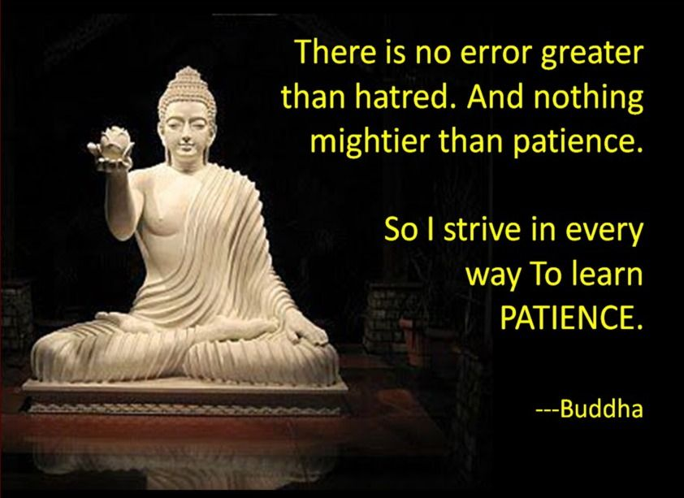

# 알고리즘 풀이

- 언어: Python
- 문제: [백준](https://www.acmicpc.net/workbook/top)
***
- [자료구조-1](https://github.com/9JIMIN/algorithm/blob/master/자료구조-1.md)
- [수학-1](https://github.com/9JIMIN/algorithm/blob/master/수학-1.md)
- [다이나믹 프로그래밍-1](https://github.com/9JIMIN/algorithm/blob/master/다이나믹프로그래밍-1.md)
- [브루트포스-1](https://github.com/9JIMIN/algorithm/blob/master/브루트포스-1.md)

참는자에게 복이 있나니..

